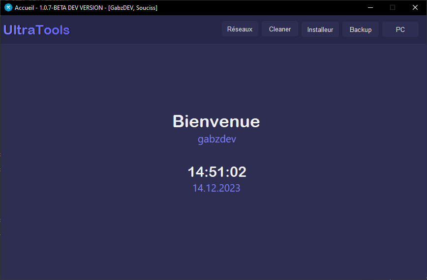

# UltraTools

## fonctionnalités
- Réseaux
- Cleaner
- Installeur
- Backup
- PC

### Réseaux
> Afficher des informations sur les interfaces réseau. 
> Scanneur de port. 
> Whois.
### Cleaner
> Vide le cache de Firefox.
### Installeur
> Non disponible...
### Backup
> Non disponible...
### PC
> Affiche informations des composants.

