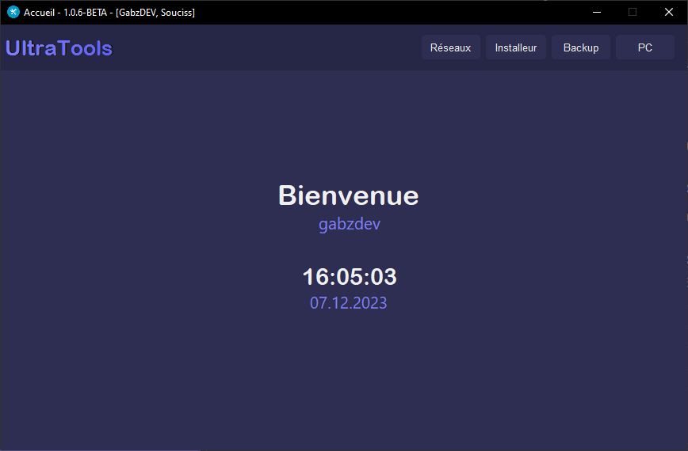

# UltraTools

## fonctionnalités
- Réseaux
- Installeur
- Backup
- PC

### Réseaux
> Afficher des informations sur les interfaces réseau. 
> Scanneur de port. 
> Whois.
### Installeur
> Non disponible...
### Backup
> Non disponible...
### PC
> ...

